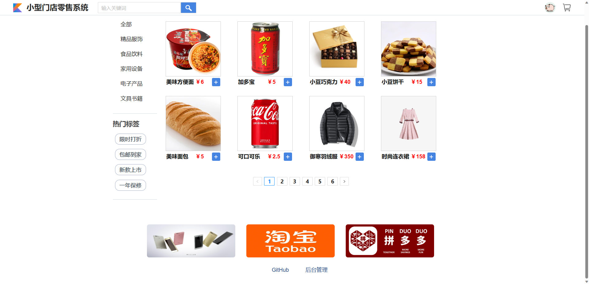
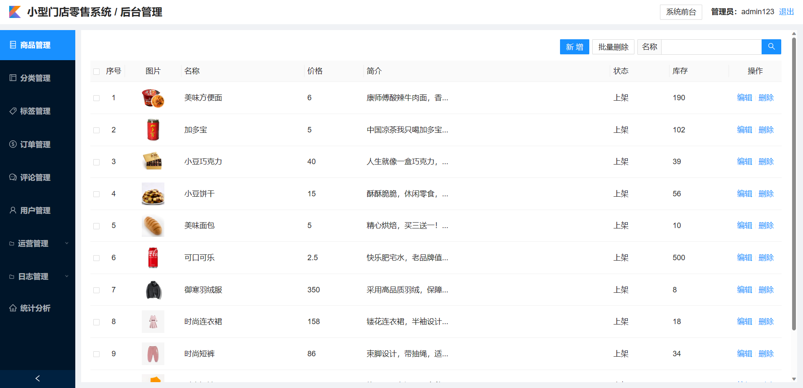

## 小型门店零售系统

### 技术栈

SpringBoot + Vue + MyBatis-Plus + MySQL + Redis + ElasticSearch + RabbitMQ + Maven + Nginx + Linux + Git

### 功能介绍

平台采用 B/S 结构，包括前台和后台两个部分，后端采用 Springboot 框架开发，前端采用 Vue 框架开发

- 前台：首页、商品详情、商品搜索、广告、评论、订单、购物车、用户中心模块、异步邮件推送等
- 后台：订单管理、商品管理、分类管理、标签管理、评论管理、用户管理、运营管理、日志管理、统计分析等

### 代码结构

server 目录是后端代码、msg 目录是 MQ 消费者代码、web 目录是前端代码

### 界面预览

### 待完善功能

- 分享功能
- 支付功能
- ......

